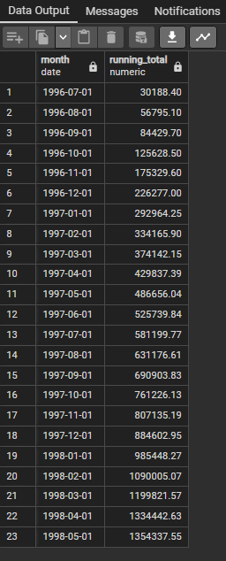

# Northwind Sales Insights Project

This project uses the classic Northwind database to answer key business questions using SQL. It showcases my ability to write clear, optimized queries and derive insights relevant to stakeholders.

## Business Questions Answered

1. Rank employees by total sales
2. Calculate monthly running totals
3. MoM sales growth
4. Identify high-value customers
5. Analyze sales by product category
6. Find top-performing products per category
7. Identify top 20% customers by total purchase volume
8. Compare each employee's performance to the average

## Tools Used
- PostgreSQL
- SQL (CTEs, window functions, date functions)

## Sample Output
1. Employee Ranking  
  
2. Monthly Sales Running Total  
  
3. Month on Month Sales  

4. High-value customers

5. Top Products per Category  
  
Sales Proportion by Country  
  
Top 20% Customers  
  
Employee Sales Performance vs Average  

