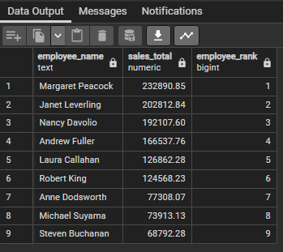
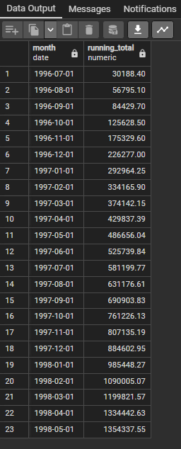
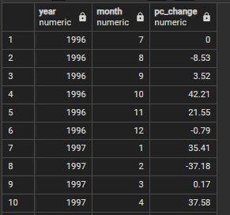
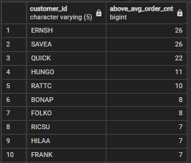
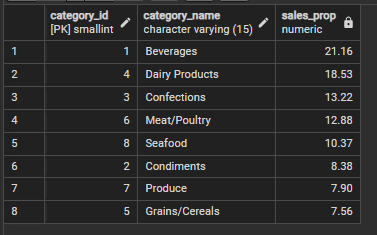
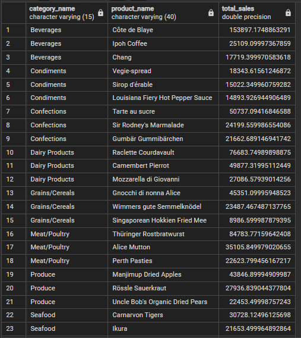
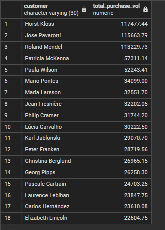
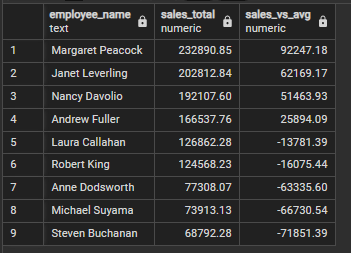

# Northwind Sales Insights Project

This project uses the classic Northwind database to answer key business questions using SQL.

## Business Questions Answered

1. Rank employees by total sales
2. Calculate monthly running totals and MoM sales growth
3. Identify high-value customers
4. Analyse sales by product category
5. Find top-performing products per category
6. Identify top 20% customers by total purchase volume
7. Compare each employee's performance to the average

## Tools Used
- PostgreSQL
- SQL (CTEs, window functions, date functions)

## Schema
  

## Sample Output
1. Employee Ranking  
  
2. Running Total of Monthly Sales  
  
3. Month on Month Sales  
  
4. Customers with Above Average Orders  

5. Sales Proportion by Category  
  
6. Top Products per Category  
  
7. Top 20% Customers  
 
8. Employee Sales Performance vs Average  

  

## Full SQL Logic

The complete set of SQL queries (including CTEs, window functions, and analytical logic) is available here:  
[View the SQL queries](sql_queries.md)